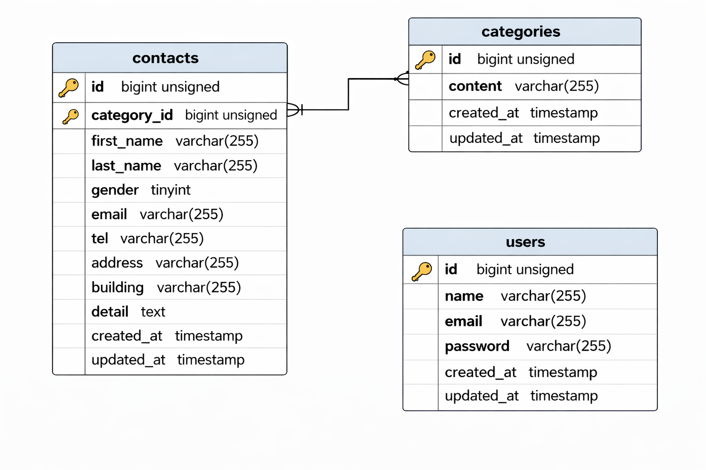

# お問い合わせフォーム

## 環境構築

### Dockerビルド

1. `git clone <git@github.com:youmean3010/Yumi-kadai1.git>`
2. DockerDesktopアプリを立ち上げる
3. `docker-compose up -d --build`

---

### Laravel環境構築

1. `docker-compose exec php bash`
2. `composer install`
3. 「.env.example」ファイルをコピーして「.env」を作成し、DBの設定を変更
4. 
```text
DB_HOST=mysql
DB_DATABASE = laravel_db
DB_USERNAME = laravel_user
DB_PASSWORD= laravel_pass
```

5. アプリケーションキーの作成

```bash
php artisan key:generate
```

6. マイグレーションの実行

```bash
php artisan migrate
```

7. シーディングの実行

```bash
php artisan db:seed
```
## ER図



## 使用技術
- PHP 8.1.34
- Laravel Framework 8.83.8
- Mysql:8.0.26
- Docker version 28.4.0
- Nginx:1.21.1
- Laravel Fortify（認証機能）
- FormRequest（バリデーション）
  

##　プッシュ方法

- git init
- git add .
- git commit -m "Initial commit"
- git remote add origin git@github.com:youmean3010/Yumi-kadai1.git
- git branch -M main
- git push -u origin main

## URL
- 開発環境：http://localhost
- phpMyAdmin：http://localhost:8080

````